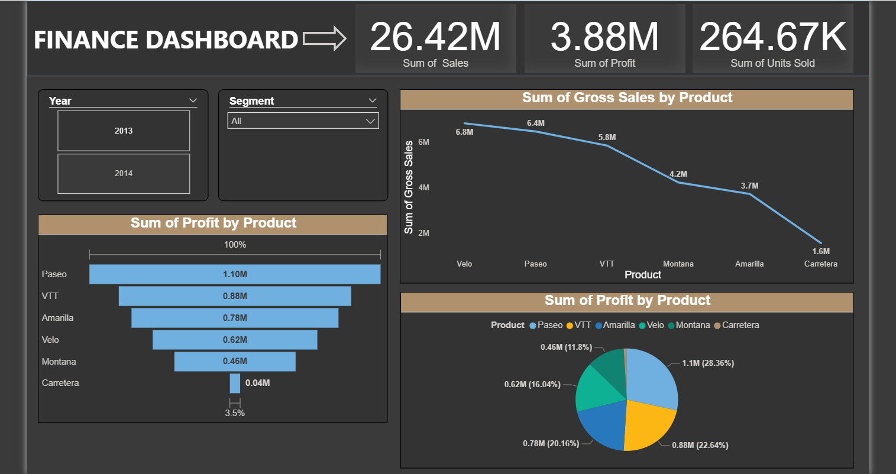

Dashboard Screenshot .png
# 📊 Power BI Finance Dashboard

## 📌 Overview

This project showcases an interactive **Finance Dashboard** built using **Power BI**.
It provides insights into **sales, profit, and product performance**, helping users make data-driven decisions.

---

## 🖼️ Dashboard Preview

---

## 🚀 Features

* 📈 Total Sales, Profit, and Units Sold overview
* 📊 Product-wise performance analysis
* 📉 Gross Sales trends by product
* 🥧 Profit distribution across products
* 🔍 Filters for Year and Segment

---

## 📂 Files Included

* `PBI.pbix` → Power BI dashboard file
* `Dashboard Screenshot.png` → Dashboard preview image

---

## 🛠️ Tools & Technologies

* **Power BI** – Data visualization
* **Microsoft Excel / Dataset** – Data source (if applicable)

---

## 📊 Key Insights

* Paseo generates the highest profit among all products
* VTT and Amarilla contribute significantly
* Carretera has the lowest performance

---

## ▶️ How to Use

1. Download the `.pbix` file
2. Open it in **Power BI Desktop**
3. Explore the dashboard using filters

---

## 👤 Author

Your Name

---

## ⭐ Support

If you like this project, give it a ⭐ on GitHub!
